  

## Hi, I'm roziko

I build tools around **Claude Code**: the small things that make long AI coding sessions easier to live with.

- 🛠️ Working on a status display for Claude Code sessions *(not public yet)*
- 🔍 [Reporting what I find](https://github.com/anthropics/claude-code/issues?q=is%3Aissue+author%3Aroziko) to Claude Code
- 🌏 Based in Japan
